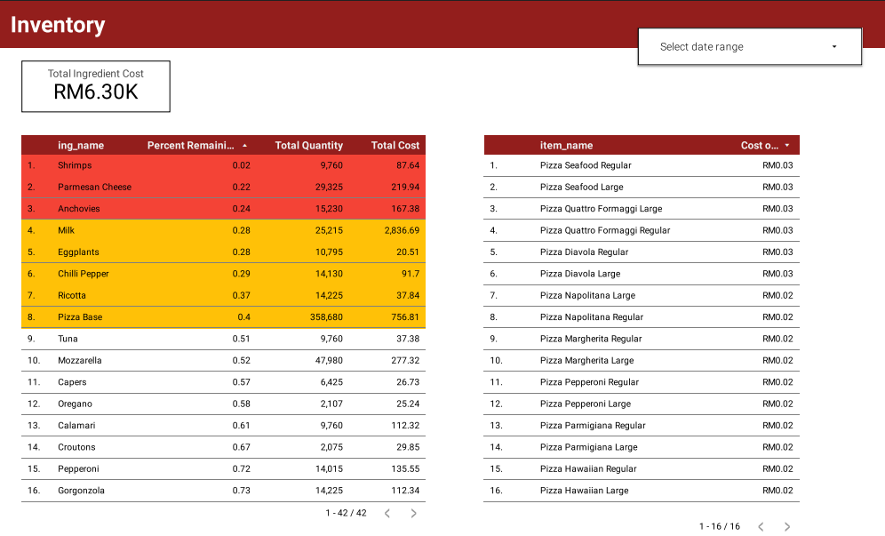

# Alor Setar Pizza Hut - From SQL Database to Interactive Dashboard

<div align="center">
  
</div>

## Overview
When it comes to running a successful restaurant, it’s not just about serving great food. Behind every pizza sold lies a story of ingredients, staffing schedules, customer behavior, and cost management. To explore these hidden layers, I created a fictional dataset (csv) using **Python's Faker** library, inspired by a real-world location—**Pizza Hut in Alor Setar**, Malaysia. The primary goal is to uncover sales patterns, identify popular products, understand customer behavior based on time and day, and provide actionable recommendations for business improvement through targeted dashboards.

## Problem Statement & Objectives

The key business questions this analysis aims to answer are:

1.  What are the busiest days and times for the pizzeria?
2.  How many pizzas are typically included in an order?
3.  Which pizzas are the most and least popular?
4.  Which pizzas generate the most revenue?
5.  Which pizza sizes are most commonly ordered?
6.  What is the distribution of orders throughout the year?
7.  How can inventory be effectively managed based on usage and cost?
8.  How can staff scheduling and costs be monitored? 
9.  What actionable insights can be derived to optimize operations, marketing, inventory, and staffing?

## Tools & Technologies
*   **Quick Database Diagrams (QuickDBD)**: For designing the database schema.
*   **MySQL**: As the relational database management system.
*   **Navicat**: A database administration tool used for creating the database, tables, and importing data.
*   **Google Looker Studio**: As the business intelligence and dashboarding platform.
*   **Microsoft Excel**: For initial data organization and mockups.

## Methodology

The analysis followed these steps:
1.   **SQL Database Design**: Creating a bespoke relational database schema. Exploring the database schema and understanding the relationships between tables.
2.   **Data Normalization**: Organizing data to reduce redundancy and improve efficiency.
3.   **Writing Custom SQL Queries**: Extracting, transforming, and aggregating data using SQL.
4.   **Database Management**: Creating a database and populating tables using a tool like Navicat.
5.   **Connecting to BI Tools**: Integrating a SQL database with a business intelligence platform (Google Data Studio).
6.   **Dashboard Creation**: Building interactive visualizations to monitor business performance.


## Project Phases

### 1. SQL Database Design and Build
*   **Scenario**: Generating fictional database for a takeout and delivery pizzeria focusing on customer orders, stock levels, and staff using Python's Faker Library.
* ```bash
  from faker import Faker
  ```
*   **Requirements Gathering**: Identifying the key data points to capture for each area (customer orders, stock, staff) based on the client's brief.
*   **Table Design**: Specifying the fields and data types for each table, starting with customer orders (item name, price, quantity, customer name, delivery address).
*   **Normalization**: Reducing data redundancy by creating separate tables for customers, delivery addresses, and products (menu items) and linking them using identifiers (primary and foreign keys).
*   **Database Diagram**: Using a tool called Quick Database Diagrams (QuickDBD) to visually design the database and define table relationships.
<div align="center">
  
</div>
*   **SQL Code Generation**: Exporting the SQL code (MySQL syntax in this case) from QuickDBD to create the database schema.
*   **Database Creation**: Creating a new database (Pizza DB) in a MySQL instance using Navicat.
*   **Table Creation**: Executing the generated SQL code to create the tables in the database.
*   **Data Population**: Importing data into the tables, for example, importing ingredient data from a CSV file using Navicat's import wizard.

### 2. Writing Custom SQL Queries

*   **Objective**: Creating SQL queries to generate views of the data needed for the dashboards.
*   **Orders Dashboard Queries**: Writing queries to calculate:
    *   Total orders (count distinct of `order ID`).
    *   Total sales (sum of `item price` \* `quantity`).
    *   Total items sold (sum of `quantity`).
    *   Sales by category (group by `item category`, sum of `item price` \* `quantity`).
    *   Top selling items (group by `item name`, sum of `item price` \* `quantity`, order by descending).
    *   Orders by hour (extract hour from `created at`, count `order ID`).
    *   Sales by hour (extract hour from `created at`, sum of `item price` \* `quantity`).
    *   Orders by address (joining orders and address tables).
    *   Orders by delivery method (group by `delivery method`, count `order ID`).
    *   Using table aliases (e.g., `o` for orders, `i` for item, `a` for address) to simplify query syntax.
    *   Employing `LEFT JOIN` to combine data from multiple tables (orders, item, address) based on foreign key relationships.

```bash:
SELECT
  o.order_id,
  i.item_price,
  o.quantity,
  i.item_cat,
  i.item_name,
  o.created_at,
  a.delivery_address1,
  a.delivery_address2,
  a.delivery_city,
  a.delivery_zipcode,
  o.delivery
FROM
  orders o
  LEFT JOIN item i ON o.item_id = i.item_id
  LEFT JOIN address a ON o.address_id = a.address_id
```

*   **Inventory Dashboard Queries**: Creating queries to determine:
    *   Total quantity by ingredient (joining orders, item, recipe, and ingredient tables, using aggregation and `GROUP BY`).
    *   Total cost of ingredients (multiplying order quantity by recipe quantity and unit cost, using a subquery to handle aggregated fields).
    *   Calculated cost of each pizza (multiplying recipe quantity by unit cost).
    *   Percentage stock remaining by ingredient (joining the result of ingredient usage with the inventory table, calculating remaining quantity).
    *   Creating a view (`stock_one`) from a custom SQL query for easier manipulation.
```bash:
SELECT
  s2.ing_name,
  s2.ordered_weight,
  ing.ing_weight*inv.quantity AS total_inv_weight,
  (ing.ing_weight * inv.quantity) - s2.ordered_weight AS remaining_weight
FROM
  (SELECT ing_id, ing_name, sum(ordered_weight) AS ordered_weight FROM stock1 GROUP BY ing_name, ing_id) s2
  
left JOIN inventory inv on inv.item_id = s2.ing_id
LEFT JOIN ingredient ing on ing.ing_id = s2.ing_id
```

*   **Staff Dashboard Queries**: Writing queries to calculate:
    *   Staff cost per row (calculating the duration of each shift and multiplying by the hourly rate).
    *   Joining staff, rotor, and shift tables to retrieve relevant information.
    *   Using the `TIMEDIFF` function to calculate the difference between start and end times.
```bash:
SELECT
  r.DATE,   
  s.first_name,
  s.last_name,
  s.hourly_rate,
  sh.start_time,
  sh.end_time,
  (
    (HOUR(timediff(sh.end_time, sh.start_time)) * 60) + (MINUTE(timediff(sh.end_time, sh.start_time)))
  ) / 60 AS hours_in_shift,
  (
    (HOUR(timediff(sh.end_time, sh.start_time)) * 60) + (MINUTE(timediff(sh.end_time, sh.start_time)))
  ) / 60 * s.hourly_rate AS staff_cost
FROM
  rota r
  LEFT JOIN staff s ON r.staff_id = s.staff_id
  LEFT JOIN shift sh ON r.shift_id = sh.shift_id
```

### 3. Interactive Dashboard Creation
*   **BI Tool**: Using Google Data Studio as the business intelligence platform.
*   **Data Source Connection**: Connecting Google Data Studio to the MySQL database (on Google Cloud in this example) using connection details (instance connection name, database name, username, password).
*   **Custom Queries in Data Studio**: Using the "Custom Query" option to directly use the SQL queries written in the previous phase as data sources for the dashboards.
*   **Data Source Schema Review**: Verifying and adjusting the data types of the fields in Data Studio.
*   **Dashboard Building**: Creating three separate dashboards:

### 1. Order Activity Dashboard
* **Objective:** Monitor core sales and order patterns.
* **Key Metrics & Visualizations:**
    * Total orders   
    * Total sales  
    * Total items sold   
    * Average order value   
    * Sales breakdown by pizza category  
    * Top selling items (pizzas)  
    * Order volume by hour  
    * Sales revenue by hour   
    * Orders by customer address (if available)  
    * Order fulfillment method (Delivery vs. Pick up)   


### 2. Inventory Management Dashboard 

* **Objective:** Track ingredient usage, costs, and stock levels to optimize inventory and understand pizza profitability[cite: 3, 4].
* **Key Metrics & Visualizations:**
    * Total quantity consumed per ingredient  
    * Total cost of ingredients used  
    * Calculated cost per pizza based on ingredients  
    * Percentage of stock remaining per ingredient (requires initial stock data)   
    * Alerts or indicators for ingredients needing reordering  



### 3. Staff Control Dashboard  

* **Objective:** Monitor staff hours and costs  
* **Key Metrics & Visualizations:**
    * Total overall staff costs  
    * Total hours worked across all staff   
    * Hours worked breakdown by staff member  
    * Cost breakdown per staff member   
    * Staff presence per shift/day (requires shift data)  


*   **Calculated Fields in Data Studio**: Creating new metrics within Data Studio by performing calculations on existing fields (e.g., total sales, average order value, full address).  
*   **Chart Configuration**: Customizing charts by selecting dimensions and metrics, adjusting aggregations (e.g., count distinct, sum), and setting sorting options.  
*   **Conditional Formatting**: Applying rules to visually highlight data based on specific criteria (e.g., low stock levels).  
*   **Dashboard Design**: Focusing on clear and effective data presentation rather than purely aesthetic elements. Organizing and resizing widgets for better readability. Adding report-level elements like a header and date range control for consistency across pages. Minimizing unnecessary titles and using axis titles where needed.  
*   **Theme Application**: Applying a theme extracted from the restaurant's menu for branding.  

## Recommendations

Based on the analysis and dashboard insights:

1.  **Optimize Staffing:** Use the Staff Control and Order Activity dashboards to align staff schedules precisely with peak hours
2.  **Inventory Management:**
    * Reorder ingredients flagged by the Inventory Management dashboard.
    * Analyze the profitability of pizzas using the calculated cost data; consider price adjustments or promotions for high-cost/low-margin items
    * Ensure sufficient stock for ingredients used in top-selling items identified in the Order Activity dashboard
3.  **Marketing & Promotions:**
    * Target promotions during off-peak hours identified by the Order Activity dashboard.
    * Feature top-selling items prominently in marketing materials.
    * Analyze sales by delivery/pickup to optimize delivery zones or pickup processes.
4.  **Menu Strategy:** Use inventory and sales data to inform decisions about removing unpopular items or introducing new ones based on ingredient availability and cost.

## How to Use / Run the Analysis

1.  **Prerequisites:**
    * A working SQL database system (e.g., MySQL, PostgreSQL, SQLite).
    * Google's Looker Studio.
2.  **Setup:**
    * Clone the repository: `git clone [Your Repository URL]`
    * Load the dataset: Import the provided `.csv` files or execute the `.sql` database dump file (`dump_file.sql]`) into your chosen SQL database. Ensure tables for ingredients and staff/shifts are included if necessary for dashboards 2 & 3.
3.  **Run Analysis/View Dashboards:**
    * Execute any necessary SQL preprocessing scripts located in the `[sql_scripts/]` directory.
    * Open the dashboard files located in `[dashboards/]` or access them via their online links.
4.  **Interact:** Filter and explore the dashboards to gain specific insights.

From Raw Data to Real Impact
So what did we learn? By using SQL and visualizing the results in Google Looker Studio, I was able to turn rows of data into something restaurant owners and managers can actually use—whether it’s to spot popular items, cut costs, or staff more efficiently.

https://lookerstudio.google.com/reporting/350b3b1d-4c5c-407d-8be5-a0b0b58af37f


